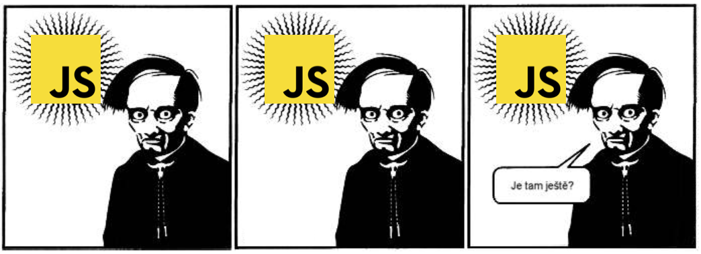

Jak tvořit komunitní web
========================

Komunitní weby, jako např. `python.cz <https://python.cz>`__, `pyvec.org <https://pyvec.org>`__, `pyworking.cz <https://pyworking.cz>`__, aj. všechny konvergují k jednomu základnímu principu, trpí ale i podobnými bolestmi. Tento návod je popisem nové, ideální architektury, ke které by se existující komunitní projekty mohly přibližovat a kterou by nově vznikající mohly dodržovat.

Není to ovšem příkaz - tvůrci a správci komunitních webů nechť se svobodně rozhodnou, zda chtějí principy zde nastíněné respektovat. Očekává se také, že větší weby, nebo weby se specifickým zaměřením, půjdou přirozeně svou cestou (např. `pycon.cz <https://pycon.cz>`__).

Výhodou společné architektury je především komunitní spravovatelnost. Jakmile několik webů funguje na stejném principu, stačí si přečíst tento návod, zorientovat se v použitých technologiích, a mohu bez větších obtíží přispívat do kteréhokoliv z nich.

Problémy s Django nebo Flask
----------------------------

Dynamická webovka v klasickém frameworku vyžaduje především *runtime*, tzn. nějaké produkční prostředí kde to pojede, kam se to bude nahrávat, kde se budou chytat chyby, kde to může spadnout, atd. Za takové prostředí se musí většinou platit a také je potřeba jej nějak spravovat. Pokud projekt potřebuje databázi, je to další správa navíc a také překážka pro kohokoliv, kdo chce do projektu přispět a nemá ji zrovna už nainstalovanou.

Celkově je tento přístup dost komplexní. Pokud někdo spravuje jednu webovku, nebo takto vydělává a platí si tým vývojářů, je to udržitelné, ale mít takto deset komunitních webovek - to prostě nejde.

Řešení: Smotáme dynamické do statického
---------------------------------------

Komplexita údržby webu lze snížit tak, že se vezme klasický framework, na kterém se vyvíjí, ale který se nakonec smotá do statických stránek. Ty lze pak bez obtíží nahrát kamkoliv. Příkladem takového řešení může být doplněk `Frozen-Flask <https://github.com/Frozen-Flask/Frozen-Flask/>`__.

Jestliže máme k dispozici `cron <https://cs.wikipedia.org/wiki/Cron>`__, `scheduler <https://elements.heroku.com/addons/scheduler>`__, nebo `pravidelně se spouštějící CI <https://docs.travis-ci.com/user/cron-jobs/>`__, může stránka obsahovat i dynamická data. Stačí, pokud nevadí, když jsou třeba den stará, a to většinou u komunitních webovek problém opravdu nebývá. Dnes už lze ale bez obtíží zajistit i častější pravidelné přegenerování - `CircleCI nabízí celou crontab syntaxi <https://support.circleci.com/hc/en-us/articles/115015481128-Scheduling-jobs-cron-for-builds->`__, takže jde web generovat klidně každých deset minut.

Dynamičnost takových stránek samozřejmě musí být v podobě toho, že aplikace postahuje z internetu nějaká data (třeba kalendáře, články přes RSS, nebo něco z API) a ta pak zobrazuje v HTML. Interakce s uživatelem (formuláře) není možná, ale u komunitních webů zpravidla není potřeba, nebo se to dá suplovat přes `Google Docs <https://docs.google.com/>`__ formuláře a tabulky.

Neexistují *runtime* problémy, neexistuje databáze (data jsou buď z internetu nebo např. ze statických YAML souborů), není potřeba žádná údržba a stačí nám hosting na statické soubory, kterýžto lze snadno sehnat i zdarma - např. `GitHub Pages <https://pages.github.com/>`__.

Výhodou je i fakt, že kdokoliv chce přispět, má za minutu lokálně web připravený k editaci, nebo může dokonce přispět i jen úpravou YAML souboru s daty přímo z rozhraní GitHubu (funkce "tužka"), což je skvělé pro začátečníky. Pokud web přes formulář ukládá nějaká data do `Google Docs <https://docs.google.com/>`__ a pak je čte a zobrazuje, tak může tabulka s daty fungovat jako instantní administrace (*back office*) pro běžné uživatele - s "excelem" umí každý.

.. note::
   Toto řešení je implementováno a komunitně udržováno jako `elsa <https://github.com/pyvec/elsa/>`__. Využívá se kombinace `Frozen-Flask <https://github.com/Frozen-Flask/Frozen-Flask/>`__, `Travis CI <https://travis-ci.org/>`__, a `GitHub Pages <https://pages.github.com/>`__.

Problémy s Frozen-Flask
-----------------------

Zatímco smotávání dynamického do statického řeší otázky provozu a uživatelských úprav, začíná v něm skřípat architektura kódu. Vývojář si brzy uvědomí, že i když píše webovku ve Flasku, může se najednou díky smotávání do statických stránek dopustit jinak neodpustitelných zkratek.

Řekněme, že chceme mít stránku, kde se budou vypisovat nejnovější články z Python komunity. Webovka bude mít k dispozici statický YAML soubor se seznamem RSS feedů, které je potřeba stáhnout, seřadit jejich články, a vypsat výsledek jako HTML. Zatímco ve světě dynamických aplikací by nikoho asi nenapadlo stahovat a zpracovávat deset feedů jeden po druhém přímo v požadavku na ``python.cz/novinky``, s Frozen-Flask to najednou "není problém". Webovka se sestavuje někde na CI a pokud jeden požadavek zabere pět minut, tak je to vlastně jedno, ne?

Jenže potom chcete přispět do nějakého komunitního webu, uděláte ``git clone``, spustíte si web lokálně přes ``pipenv run serve``, jdete do prohlížeče na ``python.cz/novinky`` a ejhle, ono to trvá pět minut, než se stránka načte. To je potom radost na takové stránce třeba upravovat CSS! Navíc, pokud se nejedná o RSS, ale o stahování z nějakého API, potřebujete mít nejspíš nastaveny nějaké autorizační tokeny apod., aby se požadavky mohly vůbec udělat. Načtení stránky v takovém případě skončí chybou. Vylepšování takového webu offline ve vlaku nebo v letadle je zcela nemožné.

Stahování dat můžeme vyčlenit do nějakého "build" skriptu. Ten bude potřebovat všechny autorizační tokeny, stáhne data, a uloží je na disk např. do JSON souboru. Ten nebude v Gitu, protože jde o dynamická data, ale webová stránka si je bude moci načíst stejně jako jiná statická data. Hurá! Onen "build" skript můžeme pustit doma a ve vlaku už pracujeme pouze s uloženými JSON soubory. Požadavek na stránku je okamžitý a když dojde na nejhorší, můžeme si nějaký ten JSON soubor vytvořit i ručně. Docílíme i lepší testovatelnosti kódu - funkce z "build" skriptu se budou nejspíše izolovat a testovat jednodušeji, než když je vše ve Flasku zabalené jako HTTP požadavek/odpověď.

Jenže najednou máme vlastně celou mašinerii s Flaskem tak nějak zbytečně. Ono z toho webového frameworku totiž zas tak mnoho použít nemůžeme (např. "redirect") a zbude nám z toho spíš takový šablonovací systém, který zbytečně spustí hromadu kódu na to, aby z JSON souboru vytvořil HTML soubor. Navíc jsme opustili konvence. Nikde není jasně řečeno, jak má fungovat "build" skript, ve které složce mají být jaké soubory, apod. Na pěti komunitních webech velmi pravdepodobně docílíme pěti mírně odlišných řešení, což lidem brání se svým přispíváním plynule přeskakovat z projektu na projekt.

Dalším problémem je frontend. Všichni sice víme, jak to má většina Pythonistů s frontendem, ale holt jednou děláme webové stránky, tak je frontend potřeba.

Dnešní moderní frontend znamená instalaci balíčků přes `npm <https://www.npmjs.com/>`__, nějaký bundler (např. `Webpack <https://webpack.js.org/>`__), nějaké CSS pre/post-procesory, apod. A to nemluvím o tom, že po roce 2015 se prakticky všichni, kteří přicházejí do frontendu jako začátečníci, učí především `React <https://reactjs.org/>`__ a vše kolem toho (mimochodem, `React Girls <https://www.reactgirls.com/>`__ založila absolventka PyLadies). Ať chceme nebo ne, frontend dnes znamená React. Jestliže si chceme frontend dělat sami, měli bychom se React aspoň trochu naučit. Jestliže chceme, aby nám někdo s frontendem na našich komunitních webovkách dobrovolně pomohl, musí být ty webovky připraveny tak, aby na nich někdo mohl moderní frontendový stack použít.

To ale s Frozen-Flask zase tak moc dobře nejde. Můžeme sice nějak použít bundler, ale HTML stále bude `Jinja2 <https://palletsprojects.com/p/jinja/>`__, což dnes už frontenďákům nic neříká, a vývoj webu bude na dnešní standardy zcela předpotopní ("to jako musím udělat refresh? kde máte hot reloading?"). Možná by to šlo nějak poslepovat lepící páskou, ale Python balíčky zabývající se integrací s frontendem jsou většinou neudržované a nikdo znalý dnešního frontendu s nimi nebude umět pracovat.

.. note::
   Rychlý průlet tím, jak jsme se od jQuery dostali do současného stavu, nabízí článek `Modern JavaScript Explained For Dinosaurs <https://medium.com/the-node-js-collection/modern-javascript-explained-for-dinosaurs-f695e9747b70>`__.

Řešení: JAM stack
-----------------

