.. _meeting-notes:

Zápisy ze schůzí
================

Zápisy jsou řazeny od nejnovějších po nejstarší. Zápisy schůzí před rokem 2019 jsou v `tomto dokumentu <https://docs.google.com/document/d/1fNOqEpoddNOB52PG-tCT6Yzw3AqHZnDE6jY08zuEywE/edit>`__.

.. contents::
   :depth: 2

6. 9. 2019 - elektronické hlasování výboru
------------------------------------------

O přijetí za členy do spolku emailem požádali:

* Dne 2. 9. Ondřej Caletka,
* dne 3. 9. Štěpánka Lucinová,
* dne 4. 9. Zuzana Javorková.

Výbor o těchto přihláškách jednorázově elektronicky hlasoval od 3. 8. do 6. 9., kdy bylo hlasování uzavřeno. Výsledek hlasování byl pro všechny přijímané členy stejný, následující:

* Martin Bílek: ano
* Jan Javorek: ano
* Jakub Vysoký: ano
* Aleš Zoulek: ano

Všichni zmínění byli 6. 9. přijati za členy spolku.

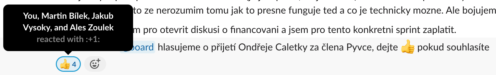

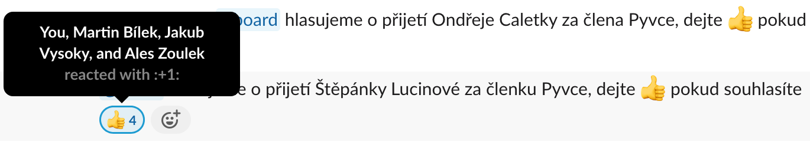

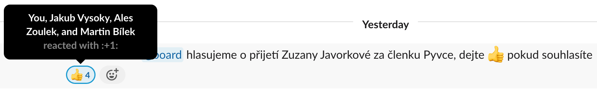

31. 8. 2019 - elektronické hlasování výboru
-------------------------------------------

O přijetí za členy do spolku emailem požádali:

* Dne 24. 8. Tomáš Orsava a Miro Hrončok,
* dne 26. 8. Lumír Balhar a Jaroslav Vysoký,
* dne 27. 8. Anežka Müller, Iva Fingerová a Bára Drbohlavová.

Výbor o těchto přihláškách jednorázově elektronicky hlasoval od 31. 8. do 3. 9., kdy bylo hlasování uzavřeno s následujícím výsledkem:

Tomáš Orsava
^^^^^^^^^^^^

* Jiří Bartoň: ano
* Martin Bílek: ano
* Jan Javorek: ano
* Jakub Vysoký: ano

Ostatní
^^^^^^^

* Jiří Bartoň: ano
* Martin Bílek: ano
* Jan Javorek: ano
* Jakub Vysoký: ano
* Aleš Zoulek: ano

Všichni zmínění byli 3. 9. přijati za členy spolku.

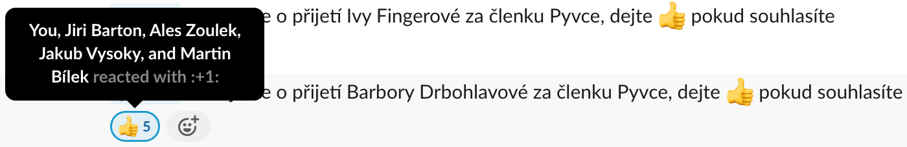

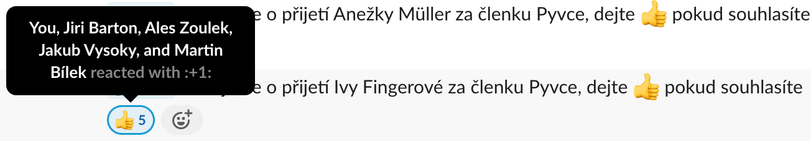

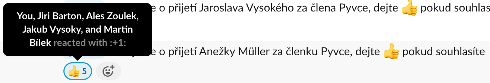

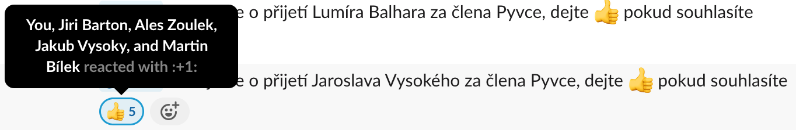

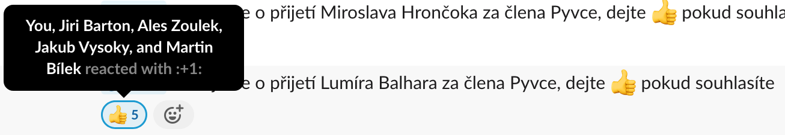

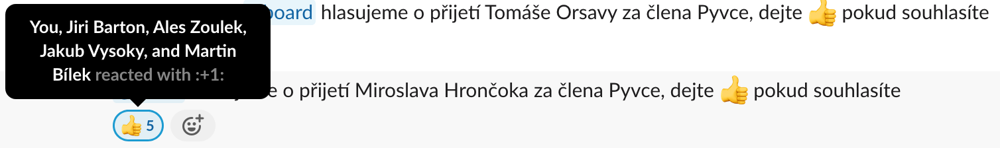

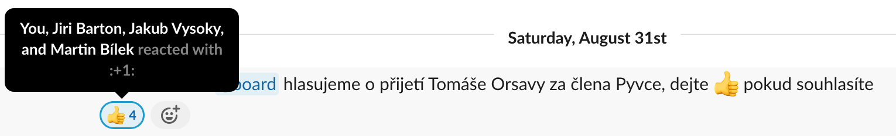

2. 7. 2019 - elektronické hlasování výboru
------------------------------------------

Dne 2. 6. Petr Viktorin požádal emailem o přijetí za člena do spolku.
Výbor o tomto jednorázově elektronicky hlasoval od 2. 7. do 12. 7., kdy bylo
hlasování uzavřeno s následujícím výsledkem:

* Jiří Bartoň: ano
* Martin Bílek: ano
* Jan Javorek: ano
* Jakub Vysoký: ano
* Aleš Zoulek: ano

Petr Viktorin byl 12. 7. přijat za člena spolku.

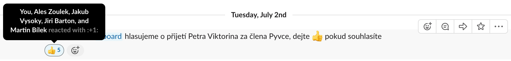
